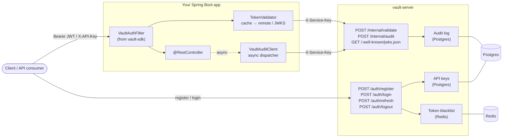
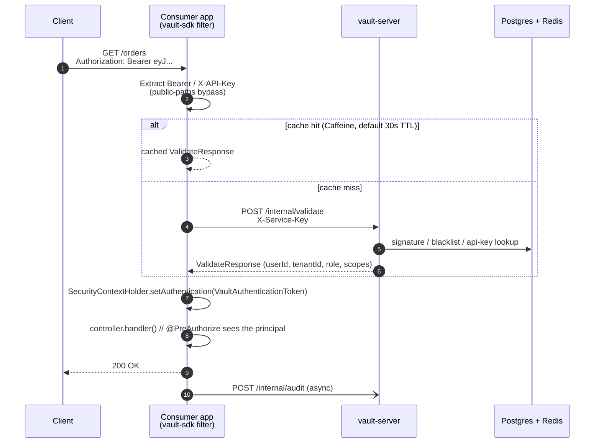
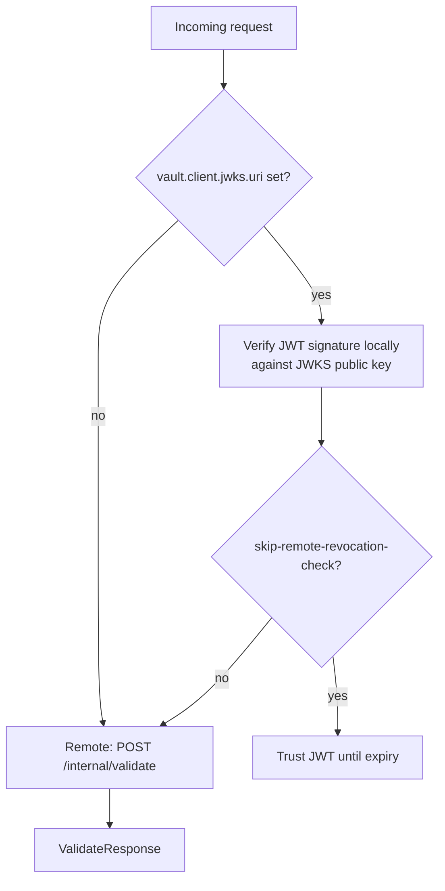

# Vault

A client SDK and standalone server that put JWT authentication, API keys, audit logging and rate limiting behind one HTTP endpoint, so Spring Boot apps don't reimplement the same security plumbing every time.

- **`vault-server`** — runs as its own service. Owns users, issues JWTs (RS256), manages API keys, records audit events, enforces rate limits. Backed by Postgres + Redis.
- **`vault-sdk`** — drop-in Spring Boot starter (~5 classes, no JPA / Redis / Flyway). Adds a filter that asks `vault-server` to validate each request and populates `SecurityContextHolder` with the result.
- **`vault-protocol`** — pure-Java DTOs shared on the wire by server and SDK. No Spring, no transitive runtime deps.

## How it fits together



The SDK speaks one wire format to the server (`vault-protocol`) and otherwise stays out of the consumer's way.

## Request flow



## Quickstart

### 1. Run vault-server

```bash
docker compose up -d   # Postgres + Redis
mvn -pl vault-server spring-boot:run
```

vault-server listens on port 8081. It auto-generates an RSA-2048 keypair at startup (logs a warning — persistent keys land in v0.2.1).

### 2. Add the SDK to your Spring Boot app

```xml
<dependency>
  <groupId>io.github.hesandaliyanage</groupId>
  <artifactId>vault-sdk</artifactId>
  <version>0.2.0</version>
</dependency>
```

```yaml
# application.yml
vault:
  client:
    base-url: http://vault.internal:8081
    service-key: ${VAULT_SERVICE_KEY}
    cache:
      enabled: true       # Caffeine, 30s TTL
  filter:
    public-paths:
      - /public/**
      - /actuator/health
  audit:
    enabled: true
```

### 3. Register the filter on your security chain

```java
@Bean
SecurityFilterChain securityFilterChain(HttpSecurity http, VaultAuthFilter vaultAuthFilter) throws Exception {
    return http
        .csrf(AbstractHttpConfigurer::disable)
        .sessionManagement(s -> s.sessionCreationPolicy(STATELESS))
        .authorizeHttpRequests(a -> a.anyRequest().permitAll())  // SDK filter is the gate
        .addFilterBefore(vaultAuthFilter, UsernamePasswordAuthenticationFilter.class)
        .build();
}
```

### 4. Use the identity in your controllers

```java
@GetMapping("/me")
Map<String, Object> me(@AuthenticationPrincipal VaultPrincipal principal) {
    return Map.of(
        "userId",  principal.userId(),
        "tenantId", principal.tenantId(),
        "role",    principal.role(),
        "scopes",  principal.scopes()
    );
}

@PostMapping("/orders")
@PreAuthorize("hasAuthority('orders:write')")
Order create(...) { ... }
```

That's the whole integration. The SDK pulls in only `spring-web`, `spring-security-web`, `jackson-databind`, `vault-protocol`, and `slf4j-api`. Caffeine (cache) and `nimbus-jose-jwt` (JWKS) are optional and only loaded when you enable them.

## Validation modes



- **Remote + cache** (default). Every token validated against vault-server, with a short Caffeine cache to amortize the hop. Safe; revocation visible within `ttl`.
- **JWKS local-verify** (opt-in via `vault.client.jwks.uri`). Signature verified locally with the server's public key; revocation still checked remotely unless you set `skip-remote-revocation-check=true`.

## Modules

| Module             | Purpose                                                                              | Heavy deps                              |
|--------------------|--------------------------------------------------------------------------------------|-----------------------------------------|
| `vault-protocol`   | Pure-Java DTOs for `/internal/*` wire format                                         | none                                    |
| `vault-server`     | Standalone Spring Boot service: JWT issuance, API keys, audit, rate limit            | Postgres, Redis, Flyway, JJWT           |
| `vault-sdk`        | Thin client: `RestClient` + filter + `SecurityContext`                               | none (Spring Web only)                  |
| `vault-sdk-legacy` | v0.1.x in-process classes, kept for one minor. **Deprecated**, removed in v0.3.0     | Postgres, Redis, Flyway, JJWT           |
| `demo-service`     | Example consumer of `vault-sdk`                                                      | none                                    |

## Docs

- [docs/architecture.md](docs/architecture.md) — internal architecture, wire format, sequence diagrams.
- [docs/redesign-v2.md](docs/redesign-v2.md) — why v0.2.0 looks the way it does.
- [docs/release-cadence.md](docs/release-cadence.md) — the release policy this project follows.
- [docs/maven-central-publishing.md](docs/maven-central-publishing.md) — Maven Central publishing steps.

## License

Apache 2.0.
