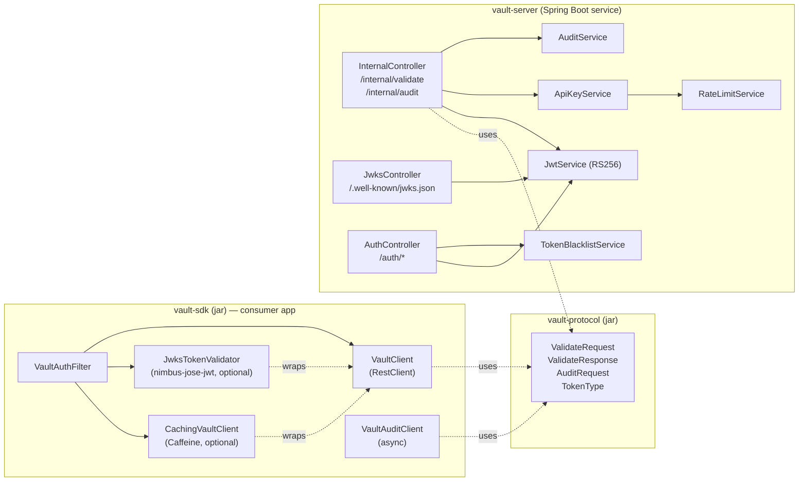
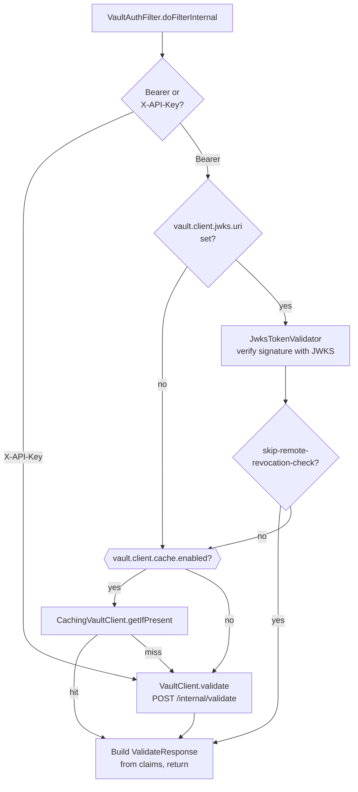
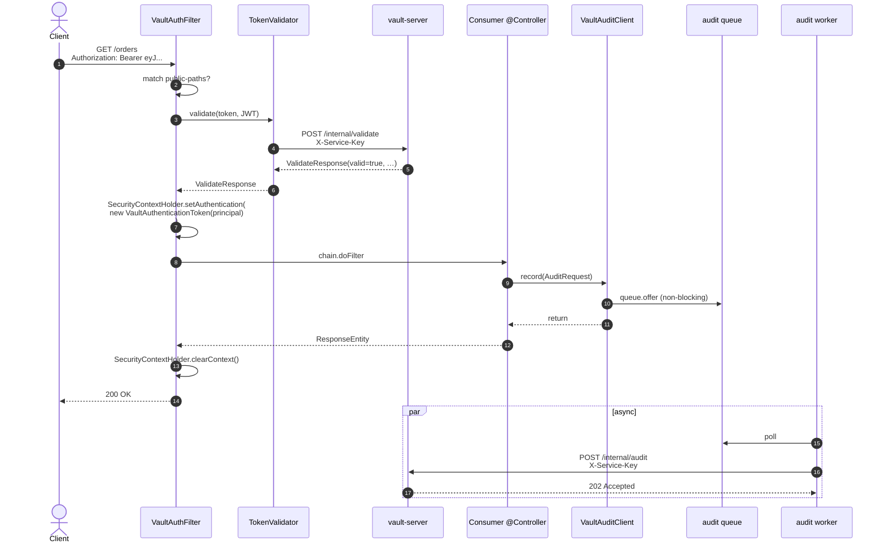

# Vault architecture (v0.2.0)

Vault is a Java security platform for Spring Boot services with two runtime parts and a shared wire contract.

## Runtime parts



- `vault-protocol` is a pure-Java jar containing only the DTOs that travel on the wire. Both server and SDK depend on it directly, so the wire contract has a single source of truth.
- `vault-sdk` is what consumer apps embed. Thin HTTP client + auth filter. Optional caching and JWKS validation are opt-in via config.
- `vault-server` is a standalone Spring Boot application. It owns all state — users, API keys, audit logs, the token blacklist, rate-limit counters.

## Wire contract

| Endpoint                          | Auth                | Purpose                                                        |
|-----------------------------------|---------------------|----------------------------------------------------------------|
| `POST /internal/validate`         | `X-Service-Key`     | Validate a JWT or API key. Returns vault id, tenant, role, scopes. |
| `POST /internal/audit`            | `X-Service-Key`     | Record an audit event (fire-and-forget, returns 202).         |
| `GET  /.well-known/jwks.json`     | none (public key)   | RSA public key for JWKS local-verify mode.                    |
| `POST /auth/register`             | none                | Register a new user. Returns the persisted vault id.          |
| `POST /auth/login`                | none                | Issue access (`RS256`, kid=vault-default) + refresh tokens.   |
| `POST /auth/refresh`              | none                | Exchange a refresh token for a new access token.              |
| `POST /auth/logout`               | Bearer              | Blacklist the current access token (Redis-backed).            |

The `/internal/*` endpoints use the DTOs defined in `vault-protocol`. The `/auth/*` endpoints are user-facing and serialize their own JSON (currently in `vault-server`'s `auth.dto` package).

## Validation modes

The SDK exposes one `TokenValidator` interface; the autoconfig composes implementations based on properties.



- **API keys** always go remote — there is no local verification path for opaque credentials.
- **JWTs** can be verified locally if a JWKS URI is configured. Local verification only catches signature and standard-claim problems; revocation is still a remote check unless explicitly skipped.

## Sequence: end-to-end request



## Failure modes

- **vault-server unreachable.** `VaultClient.validate` catches `ResourceAccessException` and returns `ValidateResponse.failure("vault-server unreachable")`. The filter maps that to 401. The caching layer deliberately does **not** cache this response, so a brief outage doesn't poison the cache.
- **vault-server returns 5xx.** Same as above but the failure reason mentions the status code. Same 401 outcome.
- **vault-server returns 401 (bad service key).** Treated as a configuration error: 401 surfaces to the client, log line names the misconfiguration.
- **Audit queue full.** Oldest events not yet drained are kept; the new event is dropped and a WARN is logged. Request threads never block on the audit channel.
- **Server restart in v0.2.0.** RSA keypair is regenerated, so all JWTs issued before the restart fail signature verification. Persistent keys are planned for v0.2.1 (see `docs/redesign-v2.md`).

## Module layout

```
theVaultOfficial/
├── vault-protocol/     pure-Java DTOs
├── vault-server/       Spring Boot service
├── vault-sdk/          thin client
├── vault-sdk-legacy/   v0.1.x classes (@Deprecated, removed in v0.3.0)
├── demo-service/       example consumer
├── docs/
│   ├── architecture.md          (this file)
│   ├── redesign-v2.md           rationale for the v0.2 design
│   ├── release-cadence.md       release policy
│   └── maven-central-publishing.md
└── docker-compose.yml  Postgres + Redis for vault-server
```
