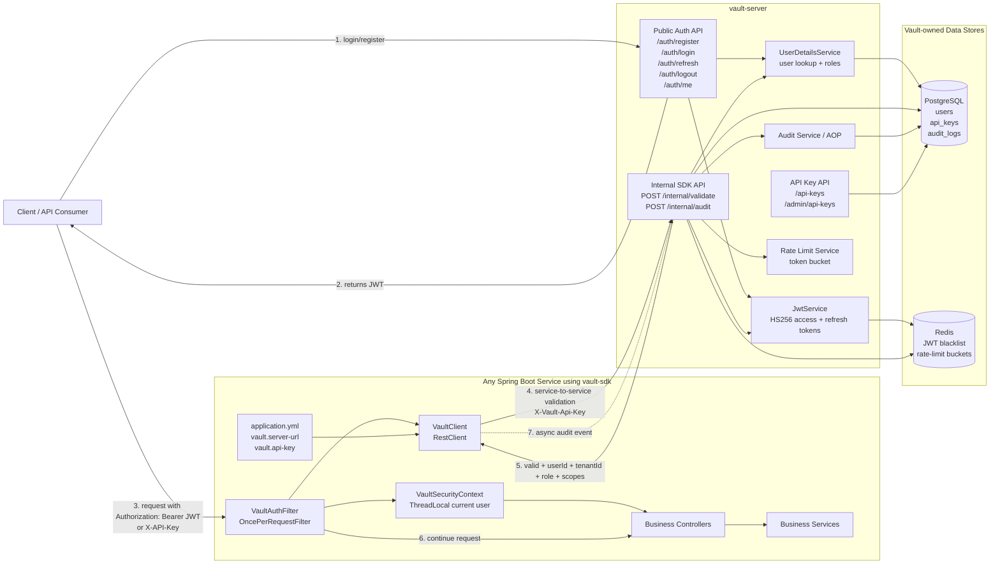
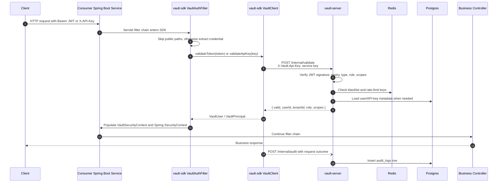
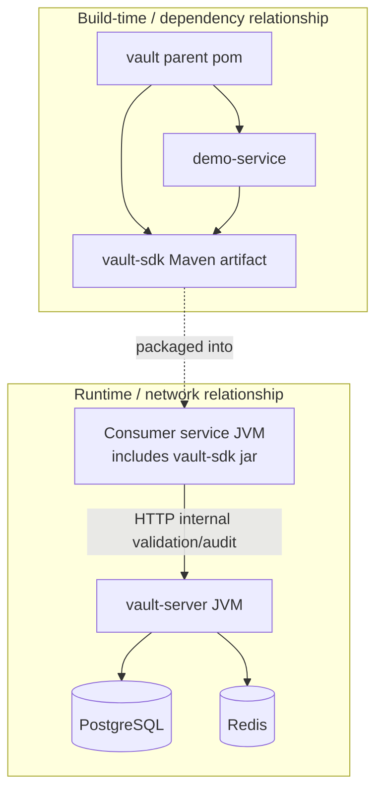

# Vault Architecture

Vault is a reusable Java security platform for Spring Boot services. It has two runtime parts:

- `vault-server`: the central identity and authorization service. It owns users, API keys, JWT issuing/validation, audit logs, Redis-backed token revocation, and rate limiting.
- `vault-sdk`: a Maven library added to any Spring Boot service. It auto-registers a servlet filter, calls `vault-server` for validation, and exposes the validated caller identity to the host application.

`demo-service` is the sample consumer that proves the integration model.

## System Architecture



## SDK Integration Flow



## How Components Should Communicate

### 1. Consumer application to `vault-sdk`

The host service should communicate with the SDK through Spring, not by manually wiring HTTP calls.

- Add `vault-sdk` as a Maven dependency.
- Configure the SDK with Vault server URL and a service-to-service API key.
- Let Spring Boot auto-configuration create `VaultClient`, `VaultAuthFilter`, and `VaultSecurityContext`.
- Controllers and services read the current identity from `VaultSecurityContext` or Spring Security's `SecurityContextHolder`.

Recommended consumer config:

```yaml
vault:
  enabled: true
  server-url: http://vault-server:8081
  api-key: vault_service_key_issued_by_vault_server
```

The implementation guide names these properties as `vault.base-url` and `vault.service-api-key`. The current code uses `vault.server-url` and `vault.api-key` in `VaultProperties`, so either the guide or the property class should be aligned before publishing the SDK.

### 2. `vault-sdk` to `vault-server`

The SDK should be the only part of the consumer service that talks to `vault-server`.

- `VaultAuthFilter` extracts the incoming caller credential.
- `VaultClient` sends validation requests to `vault-server`.
- Every SDK-to-server request includes the consumer service API key in `X-Vault-Api-Key`.
- `vault-server` treats `/internal/**` as service-to-service endpoints, separate from user-facing authentication.

Recommended validation contract:

```http
POST /internal/validate
X-Vault-Api-Key: vault_service_key_issued_by_vault_server
Content-Type: application/json

{
  "token": "jwt_or_api_key",
  "type": "JWT"
}
```

Recommended response:

```json
{
  "valid": true,
  "userId": "uuid",
  "tenantId": "uuid",
  "email": "user@example.com",
  "role": "USER",
  "scopes": ["READ", "WRITE"]
}
```

### 3. `vault-server` to PostgreSQL

Only `vault-server` owns security data.

- `users`: user identity, BCrypt password hash, tenant, role, enabled flag.
- `api_keys`: BCrypt-hashed API keys, key prefix, scopes, expiry, revoke state, tenant ownership.
- `audit_logs`: cross-service audit trail with tenant, user, action, resource, status, metadata.

Consumer services should not create or duplicate these tables. Their databases stay focused on business data.

### 4. `vault-server` to Redis

Redis is used for fast, TTL-based security state:

- `blacklist:{token}`: revoked JWTs after logout until original token expiry.
- `ratelimit:{tenantId}:{keyId}:tokens`: token bucket count.
- `ratelimit:{tenantId}:{keyId}:reset`: reset timestamp for `Retry-After`.

The SDK does not need direct Redis access. Keeping Redis behind `vault-server` prevents every consumer service from needing security infrastructure credentials.

### 5. Audit communication

After each protected request, the SDK should send an asynchronous audit event to `vault-server`.

```http
POST /internal/audit
X-Vault-Api-Key: vault_service_key_issued_by_vault_server
Content-Type: application/json

{
  "tenantId": "uuid",
  "userId": "uuid",
  "action": "HTTP_REQUEST",
  "resource": "GET /orders/123",
  "status": "SUCCESS",
  "metadata": {
    "service": "orders-service",
    "durationMs": 42
  }
}
```

Audit should be best effort: a failed audit write must not break the business request unless the product explicitly requires strict compliance mode.

## Runtime Boundaries



## Current Repo vs Target Architecture

The current project already contains:

- Maven modules for `vault-server`, `vault-sdk`, and `demo-service`.
- SDK auto-configuration registration via `META-INF/spring/org.springframework.boot.autoconfigure.AutoConfiguration.imports`.
- `VaultAuthFilter`, `VaultClient`, `VaultProperties`, and `VaultSecurityContext`.
- JWT creation and validation logic in `vault-server`.
- PostgreSQL migrations for `users`, `api_keys`, and `audit_logs`.
- Redis and PostgreSQL services in `docker-compose.yml`.

The guide-level architecture still needs these implementation pieces:

- `/internal/validate` endpoint in `vault-server`.
- `/internal/audit` endpoint in `vault-server`.
- API key generation, hashing, validation, scope enforcement, and revocation services.
- Redis-backed JWT blacklist and rate limiting.
- SDK support for `X-API-Key`, public path skipping, scope/role mapping into Spring Security, and async audit dispatch.
- Alignment between guide property names and current `VaultProperties`.

